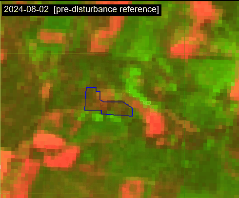
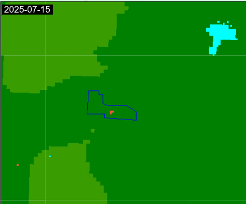

# NRT Forest Change Detection — Google Earth Engine Demo

> **Paper:** Operational event-based forest change detection using Sentinel-2 time series  
> **Authors:** Viktor Myroniuk, Yevheniy Khan, Matthew J. Gregory, Andrii Terentiev, Ihor Mischenko, Oleksandr Lesnik  

---

## Overview

This repository contains the Google Earth Engine (GEE) JavaScript code for the near-real-time (NRT) forest change detection algorithm described in the paper.

The algorithm:
1. Builds a cloud-free Sentinel-2 collection within a user-defined **monitoring window** (default: 60 days)
2. For each image, generates a **phenologically-matched synthetic reference** by evaluating the CCDC harmonic model one year prior
3. Computes the **Relativized differenced Normalized Burn Ratio (RdNBR)** between the synthetic reference and the observed image
4. Applies an **N-consecutive-flag confirmation rule** to separate confirmed disturbances from noise

---

## Demo

The animations below show the algorithm output as `currentDate` steps forward through summer 2025.

| Sentinel-2 false color (SWIR2/NIR/Red) | NRT monitoring output |
|:---:|:---:|
|  |  |

Left panel shows individual Sentinel-2 acquisitions within the monitorng window.  
Right panel shows the RdNBR values associated with `Confirmed changes` or a binary mask of `Past changes` for each monitoring run.

---

## Results

### Detection overview


*Confirmed forest disturbances (red = high RdNBR, orange = moderate) and pixels flagged in prior monitoring cycles (cyan), overlaid on a Google Satellite basemap. Blue outline = test clearcut perimeter. `currentDate = 2025-08-02`, N = 4.*

---

### Disturbance intensity (RdNBR close-up)


*Close-up of the test clearcut coloured by RdNBR disturbance intensity (orange ≈ 655 → dark red > 1 400). The confirmed-change footprint aligns closely with the blue reference polygon.*

---

### CCDC synthetic reference


*CCDC harmonic model output used as the pre-disturbance reference baseline (evaluated one year prior to each Sentinel-2 observation). The model captures seasonal phenology; deviations from this baseline drive the RdNBR signal. Blue outline = test clearcut perimeter.*

---

## Repository structure

```
├── nrt-monitoring-demo.js      # Main demo script (GEE Code Editor)
├── ccdc-utils.js               # Self-contained CCDC helper module
├── reference_polygons.geojson  # Reference clearcut polygons (validation)
├── s2_animation.gif            # Sentinel-2 time series animation
├── dnbr_animation.gif          # NRT monitoring output animation
├── Illustration 1.png          # Detection overview on satellite basemap
├── Illustration 2.png          # RdNBR intensity close-up
└── Illustration 3.png          # CCDC synthetic reference image
```

---

## Public assets

Two CCDC assets are shared publicly and required by the demo script:

| Asset | Description |
|---|---|
| `projects/ee-victormyroniuk/assets/NRT/DEMO/N5050E29_2019-01-01_2025-11-01_ccdc` | CCDC multi-segment array image (Sentinel-2, 20 m, 2019–2025) |
| `projects/ee-victormyroniuk/assets/NRT/DEMO/N5050E29_2019-01-01_2025-11-01_cl_2024` | Forest/non-forest classification mask for 2024 |

The demo tile covers approximately **50.73°N, 29.47°E** (central Ukraine, ~150 ha).

---

## How to run

### Option A — Direct link *(add after publishing your GEE script)*

```
https://code.earthengine.google.com/?scriptPath=users/victormyroniuk/<repo>:nrt-monitoring-demo
```

### Option B — Copy-paste

1. Open [code.earthengine.google.com](https://code.earthengine.google.com/)
2. Create a new script in your repository
3. Copy the contents of [`nrt-monitoring-demo.js`](nrt-monitoring-demo.js)
4. Copy [`ccdc-utils.js`](ccdc-utils.js) into the **same repository**
5. Update the `require()` path on line 45:
   ```js
   var ccdc = require('users/<your-username>/<your-repo>:ccdc-utils');
   ```
6. Click **Run**

### Key parameters to explore

```js
var currentDate      = '2025-08-02'; // step through 2025-07-15 to 2025-08-28
var monitoringWindow = 60;           // days (paper uses 60)
var nConsecutive     = 4;            // consecutive flags to confirm change (2–5)
var rdnbrThreshold   = 655;          // RdNBR detection threshold
```

---

## Output layers

| Layer | Color | Meaning |
|---|---|---|
| Confirmed changes [DOY] | Magenta | Pixels confirmed as new disturbances; value = day of year of first detection |
| Confirmed changes [RdNBR] | Orange → dark red | Same pixels colored by disturbance intensity |
| Past detected changes | Cyan | Pixels flagged in a previous monitoring cycle |
| Clear pixels | Red → green | Number of cloud-free S-2 observations per pixel in the window |

---

## Algorithm parameters (paper defaults)

| Parameter | Value | Effect |
|---|---|---|
| `monitoringWindow` | 60 days | Length of the S-2 collection window |
| `hindcastYears` | 1 | Years back for the CCDC reference |
| `cloudCoverThreshold` | 30 % | Scene-level cloud filter |
| `nConsecutive` (N) | 4 | Higher N → fewer false positives, longer detection lag |
| `rdnbrThreshold` | 655 | Lower → more sensitive; 655 excludes most non-forest noise |

---

## Dependencies

- **`ccdc-utils.js`** — included in this repository; adapted from the
  [temporalSegmentation](https://code.earthengine.google.com/?accept_repo=users/wiell/temporalSegmentation)
  library by Daniel Wiell. Only the subset required by this workflow is retained.
- **CCDC assets** — pre-computed externally using the GEE CCDC implementation
  ([Pasquarella et al., 2022](https://doi.org/10.1016/j.rse.2021.112603)).

---

## Citation

If you use this code, please cite:

```bibtex
@article{myroniuk2026nrt,
  title   = {Operational event-based forest change detection using {Sentinel-2} time series},
  author  = {Myroniuk, Viktor and Khan, Yevheniy and Gregory, Matthew J. and
             Terentiev, Andrii and Mischenko, Ihor and Lesnik, Oleksandr},
  journal = {[journal name]},
  year    = {2026}
}
```

---

## License

Code is released under the **MIT License**.  
The CCDC helper functions in `ccdc-utils.js` are derived from the
[temporalSegmentation](https://code.earthengine.google.com/?accept_repo=users/wiell/temporalSegmentation)
library by Daniel Wiell — please also credit that work.

